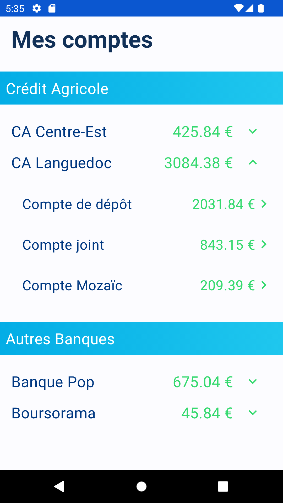
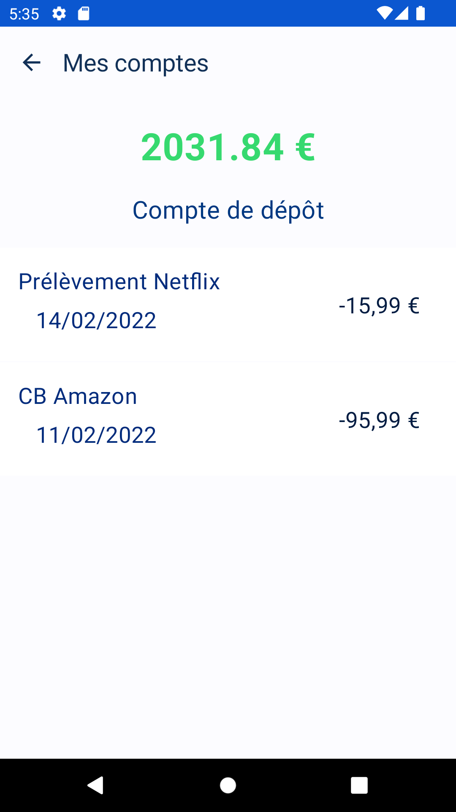

# Sample Bank App

Cette application est un exercice de création d'application bancaire. 

Voici les caractéristiques techniques : 

👅 : Kotlin
👷‍ : Clean Architecture
🎨 : Jetpack compose
💉 : Hilt
📊 : OkHttp pour les appels API ou JSON local selon l'adapteur   
🤹‍ : Mockito

